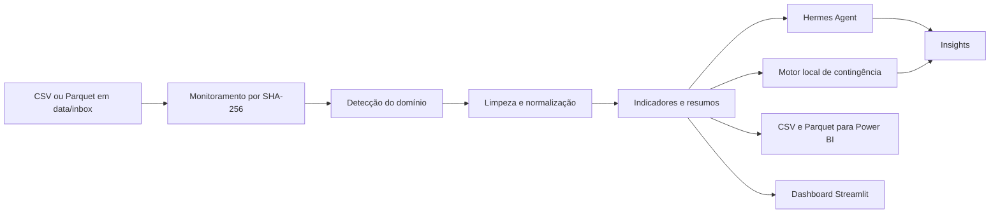

# Hermes Analytics

## 1. Visão geral

O **Hermes Analytics** é uma aplicação web local para automatizar a ingestão,
o tratamento e a análise de bases de dados. O sistema monitora uma pasta,
identifica alterações no conteúdo dos arquivos, refaz o processamento e
disponibiliza:

- indicadores e gráficos em um dashboard web;
- insights narrativos gerados pelo Hermes Agent;
- insights locais de contingência quando o Hermes está indisponível;
- arquivos CSV e Parquet preparados para uso no Power BI;
- dimensões e tabelas-resumo para apoiar a modelagem analítica.

O projeto está localizado em:

```text
C:\Users\Igor\Documents\Hermes para analise de dados
```

## 2. Objetivo

O objetivo do projeto é reduzir o trabalho manual necessário para transformar
uma base bruta em informações úteis para análise. Depois que o arquivo é
colocado na pasta monitorada, o fluxo ocorre automaticamente:

1. leitura da base;
2. identificação do domínio;
3. limpeza e normalização;
4. cálculo dos indicadores;
5. criação das tabelas para Power BI;
6. geração dos insights;
7. atualização do dashboard.

## 3. Base utilizada

A base ativa é:

```text
data\inbox\base_atual.csv
```

Ela contém dados agregados do **Sistema de Informações de Créditos (SCR)**,
referentes à data-base de **31 de janeiro de 2026**.

### 3.1 Dimensões disponíveis

- Unidade Federativa (`uf`);
- segmento da instituição;
- tipo de cliente (`PF` ou `PJ`);
- CNAE ou ocupação;
- porte ou faixa de renda;
- modalidade e submodalidade;
- origem dos recursos;
- indexador.

### 3.2 Medidas disponíveis

- número de operações;
- valores a vencer por faixa de prazo;
- carteira a vencer;
- carteira vencida;
- carteira ativa;
- carteira em inadimplência;
- ativo problemático.

### 3.3 Indicadores derivados

O sistema acrescenta:

- taxa de inadimplência;
- taxa da carteira vencida;
- taxa de ativo problemático.

As taxas consolidadas são calculadas pela divisão entre os valores agregados,
evitando a média simples de percentuais.

### 3.4 Resumo da base atual

| Indicador | Resultado aproximado |
|---|---:|
| Registros | 310.553 |
| Colunas após tratamento | 27 |
| Carteira ativa | R$ 7,39 trilhões |
| Carteira em inadimplência | R$ 325,10 bilhões |
| Taxa de inadimplência | 4,40% |
| Ativo problemático | R$ 575,89 bilhões |
| Taxa de ativo problemático | 7,79% |
| Número de operações disponível | 921,16 milhões |

Valores negativos em `numero_de_operacoes`, usados na fonte para indicar
informação indisponível, são convertidos em valores ausentes.

## 4. Arquitetura



### 4.1 Componentes principais

| Arquivo | Responsabilidade |
|---|---|
| `app.py` | Interface Streamlit, filtros, gráficos, abas e downloads |
| `src/hermes_analytics/pipeline.py` | Monitoramento, processamento e publicação dos artefatos |
| `src/hermes_analytics/analyzer.py` | Limpeza, detecção do domínio, indicadores e tabelas analíticas |
| `src/hermes_analytics/hermes_client.py` | Integração com o executável local do Hermes |
| `tests/test_pipeline.py` | Testes do pipeline, SCR, autorreparo e concorrência |
| `iniciar.ps1` | Preparação do ambiente e inicialização da aplicação |
| `iniciar_demo.bat` | Atalho para iniciar a demonstração |

## 5. Monitoramento automático

A aplicação verifica a pasta `data\inbox` a cada cinco segundos. O arquivo
`base_atual.csv` tem prioridade sobre as bases demonstrativas.

O sistema calcula o hash SHA-256 do arquivo. O pipeline só é executado
novamente quando:

- o conteúdo da base muda;
- o usuário clica em **Reprocessar agora**;
- algum artefato obrigatório está ausente.

### 5.1 Segurança durante atualizações

Os novos arquivos são gerados primeiro em uma pasta temporária. Somente depois
de todos estarem prontos eles substituem os arquivos publicados.

O manifesto é atualizado por último. Isso impede que o dashboard leia caminhos
para arquivos ainda não criados.

Um arquivo de bloqueio também impede dois processamentos simultâneos de
apagarem ou sobrescreverem os mesmos artefatos.

## 6. Dashboard

O dashboard principal apresenta:

- carteira ativa;
- valor em inadimplência;
- taxa de inadimplência;
- ativo problemático;
- número de operações;
- maiores carteiras por UF;
- inadimplência por segmento;
- relação entre risco e volume por modalidade;
- amostra da base tratada.

### 6.1 Filtros

O usuário pode filtrar os resultados por:

- UF;
- cliente;
- segmento;
- modalidade.

Todos os indicadores e gráficos são recalculados sobre o conjunto filtrado.

### 6.2 Abas

| Aba | Conteúdo |
|---|---|
| Dashboard | Indicadores, filtros, gráficos e amostra dos dados |
| Insights | Análise narrativa do Hermes ou do motor local |
| Power BI | Caminho e downloads das tabelas exportadas |
| Qualidade | Resumo da limpeza e colunas detectadas |

## 7. Integração com o Hermes

O sistema chama o executável local:

```text
hermes
```

O diretório de configuração utilizado neste computador é:

```text
C:\Users\Igor\AppData\Local\hermes
```

O processo do Hermes roda localmente, mas o provedor configurado pode precisar
de internet. Atualmente, a integração usa a autenticação existente do OpenAI
Codex.

### 7.1 Contingência

O dashboard não depende exclusivamente do modelo. Se ocorrer:

- falta de internet;
- tempo limite;
- falha de autenticação;
- indisponibilidade do executável;

o pipeline utiliza insights determinísticos produzidos pelo motor local. Os
indicadores, gráficos e arquivos para Power BI continuam funcionando.

Para desativar as chamadas automáticas ao Hermes:

```powershell
$env:HERMES_AUTO_INSIGHTS = "0"
.\iniciar.ps1
```

## 8. Integração com Power BI

Os arquivos são publicados em:

```text
outputs\powerbi
```

### 8.1 Tabela fato

- `fato_credito.parquet`;
- `fato_credito.csv`.

O arquivo Parquet é recomendado por ser menor, preservar os tipos e carregar
mais rapidamente.

### 8.2 Dimensões

- `dim_uf.csv`;
- `dim_segmento.csv`;
- `dim_cliente.csv`;
- `dim_cnae_ocupacao.csv`;
- `dim_porte.csv`;
- `dim_modalidade.csv`;
- `dim_submodalidade.csv`;
- `dim_origem.csv`;
- `dim_indexador.csv`.

### 8.3 Tabelas-resumo

- `resumo_uf.csv`;
- `resumo_segmento.csv`;
- `resumo_cliente.csv`;
- `resumo_porte.csv`;
- `resumo_modalidade.csv`;
- `resumo_indexador.csv`.

### 8.4 Como conectar

No Power BI Desktop:

1. selecione **Obter dados**;
2. escolha **Parquet**;
3. importe `outputs\powerbi\fato_credito.parquet`;
4. importe as dimensões ou resumos necessários;
5. crie os relacionamentos pelos campos de negócio;
6. clique em **Atualizar** depois que o Hermes Analytics processar uma nova base.

Também é possível usar **Obter dados > Pasta** para importar os CSVs.

## 9. Execução

### 9.1 Inicialização simples

Execute:

```text
iniciar_demo.bat
```

O script cria o ambiente `.venv` na primeira execução, instala as dependências
e inicia o servidor.

### 9.2 Endereços

No computador que executa o sistema:

```text
http://localhost:8501
```

Em outro computador conectado à mesma rede:

```text
http://IP-DO-COMPUTADOR:8501
```

O computador principal precisa permanecer ligado e com a aplicação aberta.

### 9.3 Execução pelo PowerShell

```powershell
cd "C:\Users\Igor\Documents\Hermes para analise de dados"
.\iniciar.ps1
```

## 10. Atualização da base

Para trocar a base monitorada:

1. feche o arquivo caso ele esteja aberto em outro programa;
2. substitua `data\inbox\base_atual.csv`;
3. mantenha o esquema SCR ou envie outro CSV/Parquet suportado;
4. aguarde até cinco segundos;
5. confirme a mensagem **Base alterada e reprocessada**.

Também é possível enviar o arquivo pelo componente de upload do dashboard.

## 11. Qualidade e testes

Os testes podem ser executados com:

```powershell
$env:PYTHONPATH = "$PWD\src"
.\.venv\Scripts\python.exe -m pytest -q
```

Os testes verificam:

- detecção de mudanças;
- processamento de dados imobiliários;
- processamento de dados SCR;
- integração do diretório do Hermes;
- recriação de artefatos ausentes;
- segurança em processamentos simultâneos.

## 12. Solução de problemas

### Arquivo `perfil_analitico.json` não encontrado

Esse problema ocorria quando um reprocessamento apagava os arquivos antes de
publicar a nova versão. O pipeline atual usa publicação atômica e recria
automaticamente artefatos ausentes.

Clique em **Reprocessar agora** ou reinicie a aplicação se estiver executando
uma versão anterior.

### `PermissionError` em `C:\Users\Igor\.hermes`

O sistema deve usar:

```text
C:\Users\Igor\AppData\Local\hermes
```

O script `iniciar.ps1` configura `HERMES_HOME` automaticamente quando encontra
o arquivo `auth.json`.

### Hermes excedeu o tempo limite

Isso normalmente indica falta de internet ou indisponibilidade do provedor. O
motor local assume a geração dos insights e o restante do sistema continua
operando.

### Outro computador não acessa o dashboard

Verifique:

- se os computadores estão na mesma rede;
- se a porta `8501` está liberada no Firewall do Windows;
- se o endereço usa o IP correto do computador principal;
- se o processo Streamlit está em execução.

## 13. Tecnologias

- Python 3.11;
- Streamlit;
- Pandas;
- PyArrow e Parquet;
- Altair;
- Hermes Agent;
- Power BI;
- Pytest e Ruff.

## 14. Resultado

O Hermes Analytics transforma uma base bruta em um fluxo analítico
reprodutível. A solução combina processamento determinístico, visualização,
exportação para Power BI e uma camada de inteligência artificial com
contingência local, podendo ser executada no computador do usuário e acessada
por outras máquinas na rede.
